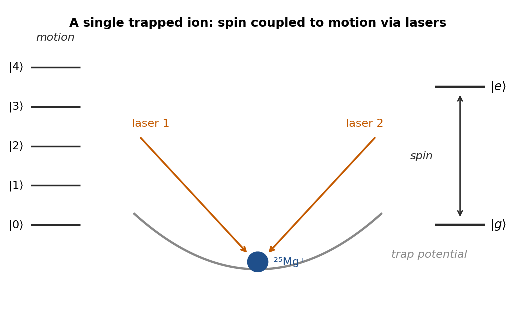
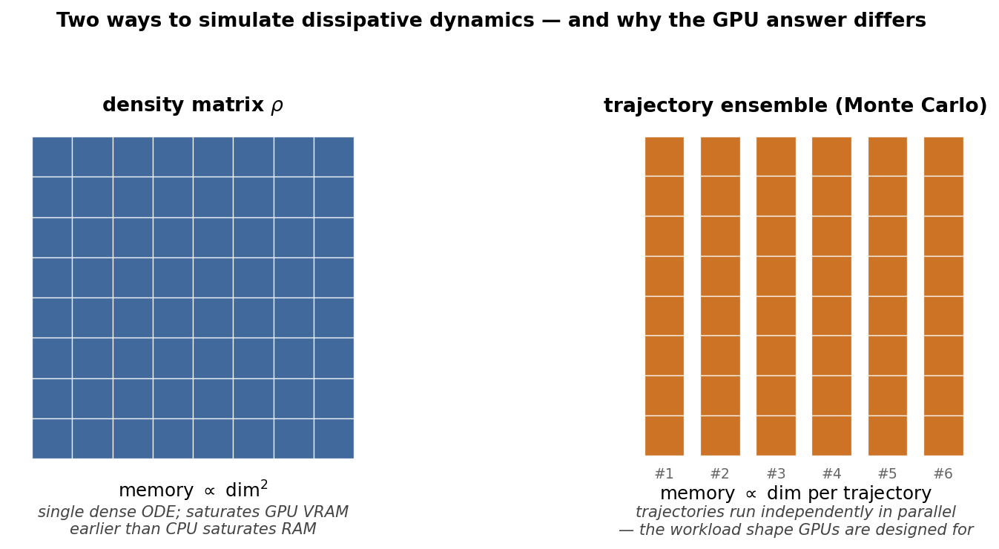

# Overview — what we do, how we do it, and what we don't claim

> **Status: ongoing work.** This page is a plain-language
> introduction to a research-software project that is still
> growing. Everything here is provisional in scope and explicit
> about its limits. Where a comparison did not turn out the way
> we expected, we say so.

`iontrap-dynamics` is an open-source Python library for
simulating the quantum behaviour of trapped ions — small numbers
of charged atoms held still in vacuum and addressed with lasers.
We use it to ask precise, falsifiable questions about how the
ions' internal state ("spin") and their motion in the trap
("phonons") evolve under a controlled experiment.

What makes the project distinctive is not the simulation
machinery itself — for that we lean on excellent existing
toolkits like [QuTiP](https://qutip.org). What makes it
distinctive is the **discipline around the results**: we
document the boundaries of every claim, publish the cases where
a hoped-for speedup or simplification did not materialise, and
keep our result-data schema stable enough that a number computed
today is still interpretable a year from now.

This page is written in three reading levels — a one-paragraph
explanation for any curious visitor, a section for students
entering the field, and a section for collaborators in theory,
experiment, or numerical methods who want to understand how we
work.

---

## In one paragraph (anyone curious)

Trapped ions are one of the most precisely controlled physical
systems in the laboratory. They are used to build atomic clocks,
to test fundamental physics, and as a leading platform for
quantum computing. Because the experiments are so precise, the
simulations that support them have to be precise too — not just
in the numbers they produce, but in the *meaning* of those
numbers: what was assumed, what was approximated, where the
result stops being trustworthy. This project provides
trapped-ion-specific simulation tools with that meaning made
explicit. It is built so that a student, a collaborator, or a
peer reviewer can read the result of a calculation and judge for
themselves whether the question we asked is the question they
need answered.

---

## What we simulate (for students entering the field)

A trapped ion is a single atom (we work most often with
²⁵Mg⁺ — a magnesium isotope with one electron stripped off)
held in place by carefully shaped electric fields. Lasers shine
on the ion to do two things: drive transitions between two of
its internal energy levels (the "qubit" or "spin"), and couple
those internal transitions to the ion's motion in the trap (the
"motional modes" or "phonons"). The combined system — spin plus
motion — is what we mean by **spin–motion dynamics**.

The library can build and evolve the standard Hamiltonians for
this physics:

- **Carrier transitions** — driving the spin without touching
  the motion.
- **Sideband transitions (red and blue)** — exchanging quanta
  between spin flips and phonons; the building block of cooling
  and motional state preparation.
- **Mølmer–Sørensen gates** — two ions entangled through their
  shared motion; the workhorse two-qubit gate for trapped-ion
  quantum computing.
- **Stroboscopic and modulated drives** — time-dependent laser
  pulses with specified envelopes, used in pulse-shaped gates
  and Floquet-engineered Hamiltonians.

On top of this it can prepare standard initial states (Fock,
thermal, coherent, squeezed), compute standard observables
(populations, motional occupation numbers, entanglement
measures), and add realistic experimental imperfections (laser
detuning drift, amplitude jitter, finite measurement shots) on
top of the ideal physics — without the imperfections leaking
back into the Hamiltonian.

The thirteen tutorials under
[Tutorials](tutorials/index.md) walk through these capabilities
one at a time, ending with a full reproduction of a published
2016 result (Clos et al.,
*Phys. Rev. Lett.* **117**, 170401) on the dynamics of a
strongly-driven Mølmer–Sørensen gate.

*A single trapped ion of ²⁵Mg⁺ held in a harmonic trap potential, addressed
by two laser beams. The motional ladder on the left labels the phonon Fock
states; the two spin levels on the right are the qubit. The library's
Hamiltonian builders construct the operators that couple these two ladders
under the action of the lasers.*

---

## How we work (for collaborators)

Most simulation toolkits in our field are written as
*handbooks* — they offer recipes that work well in many
situations, with documentation that emphasises what is possible.
This project is written as something more like a **map of a
coastline** — we mark precisely where each claim holds, where
it fails, and where we have not yet measured.

In practice, that comes down to four habits:

### 1. Conventions before code

Before we ship a feature, we write down the physical and
numerical conventions it depends on — what tensor-product order
the operators sit in, how a normal-mode amplitude is normalised,
which sign convention the rotating-wave approximation uses.
Those conventions live in a [single document](conventions.md)
that is version-locked. A result computed under conventions
v0.2 is tagged as such; if the conventions change later, old
results stay interpretable because the version they were
computed under is part of their identity.

### 2. Honest null results

When a hoped-for speedup, simplification, or new capability
does not work out, we publish the negative outcome alongside
the positive ones. The most public example so far concerns the
JAX backend.

> **Existing figure — JAX-on-CPU is not faster than scipy.**
> The dense exact-diagonalization wall-clock comparison across
> twenty-three problem sizes:

> JAX's CPU path is ~22 % slower than scipy at every measured
> size; at small sizes the difference is up to 5×. We
> nonetheless wired in the JAX backend and document the null
> result, because the value of the alternative backend is on
> different axes (GPU dispatch where it is available;
> automatic differentiation through the solver for future
> fitting work) — not raw CPU speed. Saying this out loud is
> better than letting users discover it on their own.

The performance benchmarks page collects every measured
comparison of this kind, with the same level of explicitness:
[Benchmarks](benchmarks.md).

### 3. Data points with explicit boundaries, not universal curves

When we publish a benchmark, we publish the **specific case**
we measured (which Hilbert-space dimension, which hardware,
which solver settings) along with **where it stops being a
reliable guide**. We do not aggregate benchmarks into a single
"how fast is this library" headline number, because the answer
genuinely depends on the case.

> **Existing figure — measured envelope of dense diagonalization
> on a 16 GB laptop.**

> Each point is a real measurement on commodity hardware; the
> envelope tells the user where the binding constraint flips
> from memory to wall-clock, so they can judge whether their
> intended problem fits.

> **Existing figure — extrapolation across RAM tiers.**

> The fit lines are explicitly extrapolations past the measured
> grid, not new measurements. We mark them as such in the figure
> caption rather than treating the extrapolation as data.

### 4. Stable result schemas

Every solver in the library returns a typed `TrajectoryResult`
or `SpectrumResult` object with named fields, a recorded
backend identity, the convention version it was produced under,
and a record of any structured warnings the solver issued. The
shape of that object is frozen across releases; a result file
saved a year ago and reloaded today still means what it meant
when it was saved, or fails loudly with a hash mismatch.

A reader who wants the long version of any of these four
habits can find it on the [project framework page](framework.md)
or in the [Phase 1 architecture document](phase-1-architecture.md).

---

## Where we are today

The project tagged `v0.4.0` in April 2026, after three phases
of development that built up the public surface incrementally:

| Phase | What it added                                                                 | Anchor            |
|------:|-------------------------------------------------------------------------------|-------------------|
|     0 | Result schema, exception hierarchy, hash-verified result cache, regression-test framework | Foundation       |
|     1 | Configuration objects (species, drives, modes), Hamiltonian builders, observables, measurement layer, systematics layer | Public dynamics surface |
|     2 | JAX / Dynamiqs alternative backend on the same `solve()` call; performance benchmarks; cross-backend agreement to ≲ 10⁻³ | Backend agnosticism |
|   v0.4| Reproduction of Clos et al. 2016 (PRL 117, 170401) on N = 1, 2, 3 ions inside declared tolerances; exact-diagonalization spectrum tools and four spectrum-analysis observables | First external validation |

The thirteen tutorials cover the canonical building blocks
(Rabi, sidebands, π-pulses, MS gates), reach into less common
regimes (squeezed motional states, finite-shot statistics,
hot-ion full-Lamb–Dicke dynamics), and end with the Clos 2016
reproduction as the first end-to-end validation against a
published external result.

---

## What we are working on (and what we explicitly aren't)

The most recent open thread — and a useful worked example of
how the project handles a strategic question — is **GPU
acceleration for dissipative dynamics**.

The straightforward version of "let's run on a GPU" turns out to
be the wrong question for the scales this library typically
operates at. On CPU, our benchmarks confirmed that JAX is not
faster than scipy or QuTiP for the problem sizes our users
actually encounter. On GPU, the picture is more interesting: it
depends on whether you are evolving a *density matrix* (memory
scales as the square of Hilbert-space dimension; GPU memory
saturates earlier than CPU memory) or running a *trajectory
ensemble* (memory scales linearly per trajectory and the
trajectories run in parallel — the workload shape GPUs were
designed for).

The honest answer is that GPU acceleration is worth pursuing,
but only along the **trajectory-ensemble** path, and only as a
follow-up to a smaller exact-diagonalization GPU dispatch that
we are scoping first. The full reasoning, including the
identification of a benchmark gap in the published literature
that this project is positioned to close, is laid out in the
[GPU dispatch design note](gpu-dispatch-design.md).

*The density-matrix path (left) stores `dim²` complex amplitudes in a
single object — concentrated memory pressure that saturates GPU VRAM
earlier than CPU saturates RAM. The trajectory-ensemble path (right)
stores only `dim` amplitudes per independent trajectory; the trajectories
run in parallel — exactly the workload shape GPUs are built for. This
difference, not raw clock speed, is what makes "should we run on a GPU?"
a question with two different answers depending on which path is taken.*

That kind of "we looked, here is the map, this is what we will
and will not pursue" outcome is the typical product of an open
thread on this project. The next public artefact on the GPU
question will be a measurement record on real hardware, not a
declaration that GPUs are now supported.

### What this project is not

We try to be unambiguous about scope, because the most useful
thing a focused tool can do is **point clearly at the boundary
of what it covers**:

- **Not a trap-geometry simulator.** Use `trical` for trap
  electrode design and `pylion` for classical molecular
  dynamics of ion crystals.
- **Not a hardware control stack.** Use ARTIQ or a local
  laboratory pulse-sequencer for actual experiment control.
- **Not a general open-quantum-systems toolkit.** [QuTiP](https://qutip.org)
  occupies that niche; we use it as our reference backend.
- **Not a GPU-first library.** Even when GPU dispatch lands, the
  default backend will remain CPU-based, and every GPU path
  will be opt-in through an explicit kwarg.
- **Not endorsed by any external body.** This is a local
  research-software project under active stewardship by the
  trapped-ion group at the University of Freiburg
  (AG Schätz). Where we make claims of correctness, those
  claims are testable against the regression suite shipped with
  the code; we do not claim parity with metrology bodies or
  standards organisations.

---

## Related work and where we sit

| Project                | What it does                                              | How we relate                                                   |
|------------------------|-----------------------------------------------------------|-----------------------------------------------------------------|
| [QuTiP](https://qutip.org) | General-purpose open-quantum-systems toolkit (Python) | Reference backend; we wrap it with trapped-ion-specific conventions and result schemas. |
| Dynamiqs (Python / JAX) | GPU-capable open quantum dynamics with autodifferentiation | Optional backend; we support it on the same `solve()` surface as QuTiP. |
| QuantumToolbox.jl (Julia) | Julia analogue of QuTiP with strong GPU performance       | Parallel effort in a different language; we cite their benchmarks where relevant. |
| IonSim.jl (Julia)       | Trapped-ion-specific Hamiltonians in Julia                | Closest sibling project in scope; complementary in language ecosystem. |
| pylion                  | Classical molecular dynamics of ion crystals              | Out-of-scope here; complementary tool. |
| trical                  | Trap electrode and field design                           | Out-of-scope here; complementary tool. |
| CUDA-Q                  | NVIDIA's general quantum-circuit / dynamics framework     | Generic; we read its benchmarks but do not depend on it. |

Our niche, stated plainly: **trapped-ion-specific spin–motion
dynamics in Python, with explicit conventions and stable result
schemas.** Within that niche we try to do less than QuTiP, more
than IonSim.jl, and more carefully than a general handbook.

---

## How to engage

- **Read the code.** The repository is at
  [github.com/uwarring82/iontrap-dynamics](https://github.com/uwarring82/iontrap-dynamics).
  Public API entry points are documented under
  [Phase 1 Architecture](phase-1-architecture.md).
- **Run the tutorials.** The
  [tutorials index](tutorials/index.md) walks through the full
  capability surface, ending with a published-result
  reproduction.
- **Read the benchmarks honestly.** The
  [Benchmarks page](benchmarks.md) contains every measured
  comparison, including the null results.
- **Check the conventions before importing.** [Conventions
  document](conventions.md) is the version-locked source of
  truth for what every quantity in the result objects means.
- **Get in touch.** GitHub issues are the project's primary
  inbound channel; the maintainer is U. Warring,
  AG Schätz, University of Freiburg.

We expect this overview to evolve as the project does. The
shape of the project — what it covers, what it does not, where
the open threads sit — is what we hope stays clearly visible
through any of those changes.
